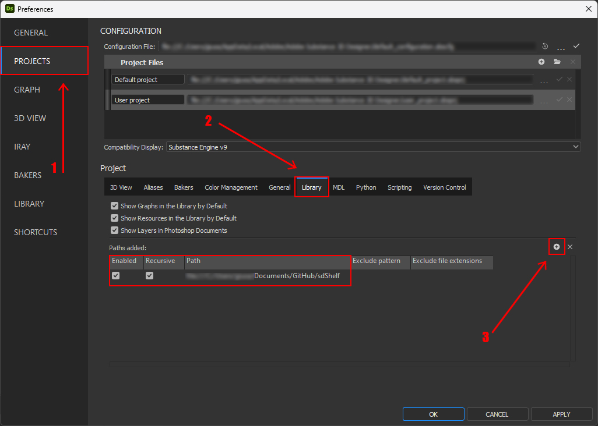
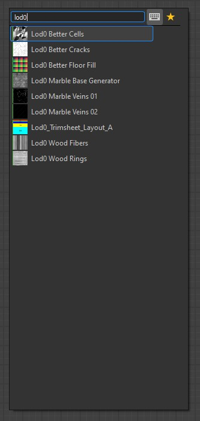

# Substance 3D Designer | lod0it sdShelf

### Welcome to the lod0 Substance Designer Nodes Repo.
This repo is dedicated to the versioning and sharing of custom nodes i've created in Substance 3D Designer to speed up ```materials``` and ```textures``` creation.

The main objective is **sharing** so feel free to join the crew if you're willing to help the community!

---

Not Familiar with Substance 3D Designer?

[Substance 3D Designer](https://www.substance3d.com/products/design) is a powerful ```node-based texturing tool``` that allows artists and designers to create complex 3D materials and textures.


## Table Of Contents

- [Installation](#installation)
- [Nodes Documentation](https://lod0.notion.site/lod0it-GitHub-92bafcca48f145f6867e4a30a278eff7?pvs=4)
- [Nodes List](https://github.com/lod0it/sdShelf/discussions/4)

---

## Installation

1. Clone the repository to your local machine:

  ```bash
   git clone https://github.com/lod0it/sdShelf.git
  ```

2. Open Substance 3D Designer.

3. Navigate to the "Edit -> Preferences -> Projects"



5. In the "Projects" tab Locate the "Library" and set the path where the repository has been cloned

6. Restart Substance 3D Designer

7. You're all set! Simply search any of the custom Nodes in the library by clicking ```space``` on your keyboard and typing the ```name``` of the Node



9. You can find all the nodes with relative description and suggested usage at this link -> [Nodes Documentation](https://lod0.notion.site/lod0it-GitHub-92bafcca48f145f6867e4a30a278eff7?pvs=4)

---

## License

This repository is licensed under the MIT License - see the [LICENSE](LICENSE) file for details.

---

Happy texturing! If you have any questions or issues, feel free to open an [issue](https://github.com/lod0it/sdShelf/issues) or join the discussion in the [Discussions](https://github.com/lod0it/shShelf/discussions) section.
