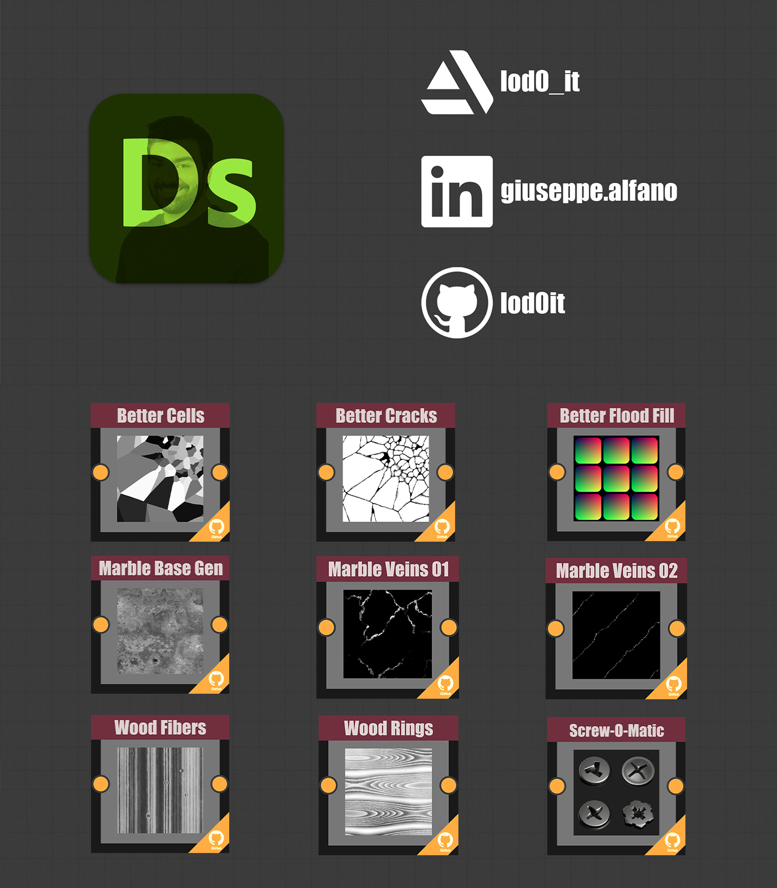
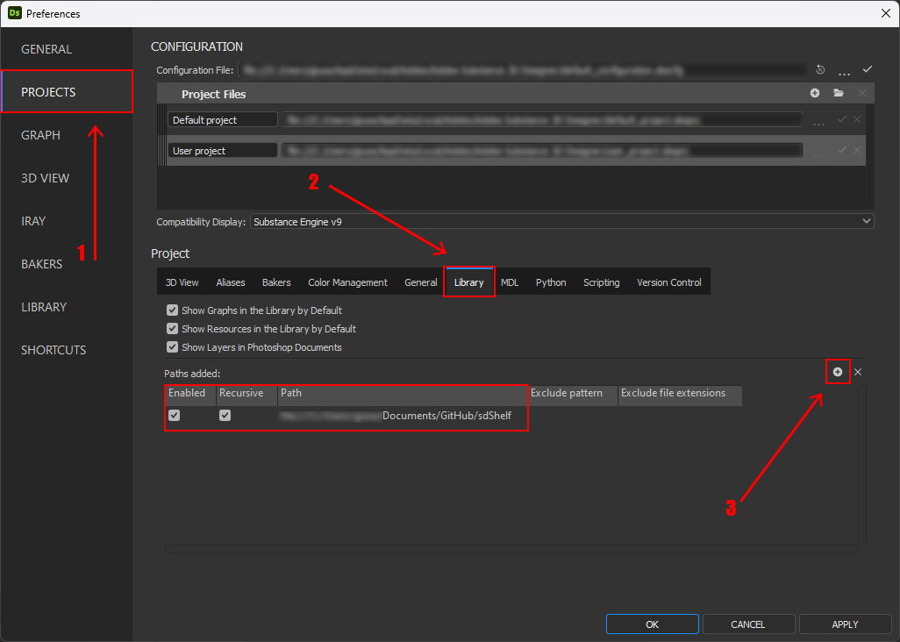
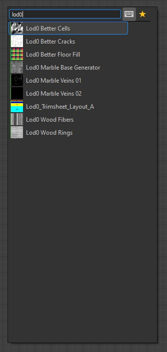

# Substance 3D Designer | lod0it sdShelf

[](LICENSE)
[](https://github.com/lod0it/sdShelf/commits/main)
[](https://github.com/lod0it/sdShelf/stargazers)

### Welcome to the lod0 Substance Designer Nodes Repo.

This repo is dedicated to the versioning and sharing of custom nodes created in Substance 3D Designer to speed up `materials` and `textures` creation.

The main objective is **sharing** — feel free to join the crew if you're willing to help the community!



---

Not familiar with Substance 3D Designer?

[Substance 3D Designer](https://www.adobe.com/products/substance3d-designer.html) is a powerful `node-based texturing tool` that allows artists and designers to create complex 3D materials and textures.

---

## Table Of Contents

- [What's Inside](#whats-inside)
- [Requirements](#requirements)
- [Installation](#installation)
- [Usage](#usage)
- [Contributing](#contributing)
- [Nodes Documentation](https://lod0.notion.site/lod0it-GitHub-92bafcca48f145f6867e4a30a278eff7?pvs=4)
- [Nodes List](https://github.com/lod0it/sdShelf/discussions/4)
- [License](#license)

---

## What's Inside

A growing collection of **10 custom nodes** organized by category.

### Filters & Generators

| Node | Description |
|------|-------------|
| `lod0_leaks` | Generates procedural leak, drip and stain patterns on surfaces |
| `lod0_marble_generators` | Procedural marble veining and stone pattern generator |
| `lod0_screw_o_matic` | Screw and bolt detail generator for hard surface textures |
| `lod0_wood_grain` | Procedural wood grain and fiber pattern generator |

### Utilities

| Node | Description |
|------|-------------|
| `lod0_better_cells` | Enhanced cell noise with improved controls and variation |
| `lod0_better_cracks` | Improved crack and fracture pattern generator |
| `lod0_better_flood_fill` | Advanced flood fill with extended control parameters |
| `lod0_color_palette` | Color palette manager for consistent material coloring |
| `lod0_delighter` | Removes baked lighting from diffuse textures (de-lighting) |
| `lod0_trimsheet_layout_a` | UV layout organizer for trimsheet texture atlases |

> Node descriptions are inferred from file names — corrections are welcome via [Issues](https://github.com/lod0it/sdShelf/issues).

---

## Requirements

- **Substance 3D Designer** 12.0 or later (recommended: latest version)
- Git (for cloning the repository)

---

## Installation

1. Clone the repository to your local machine:

   ```bash
   git clone https://github.com/lod0it/sdShelf.git
   ```

2. Open Substance 3D Designer.

3. Navigate to **Edit → Preferences → Projects**.

   

4. In the **Projects** tab, locate the **Library** section and set the path to where the repository was cloned.

5. Click **OK** to save the preferences.

6. Restart Substance 3D Designer.

7. You're all set! Open the node search by pressing `Space` on your keyboard and type the name of any node.

   

8. If you need info on nodes usage and descriptions, open the [Nodes Documentation](https://lod0.notion.site/lod0it-GitHub-92bafcca48f145f6867e4a30a278eff7?pvs=4) or the [Nodes List](https://github.com/lod0it/sdShelf/discussions/4).

---

## Usage

Filter all lod0 nodes quickly by typing `lod0` in the node search bar — this will show every node from this library at a glance.

---

## Contributing

Contributions are welcome! If you'd like to add a node, fix a bug, or improve documentation:

1. Fork the repository
2. Create a feature branch (`git checkout -b feat/my-node`)
3. Commit your changes
4. Open a Pull Request

You can also share ideas or feedback in the [Discussions](https://github.com/lod0it/sdShelf/discussions) section.

---

## License

This repository is licensed under the MIT License — see the [LICENSE](LICENSE) file for details.

---

Happy texturing! If you have any questions or issues, feel free to open an [issue](https://github.com/lod0it/sdShelf/issues) or join the conversation in the [Discussions](https://github.com/lod0it/sdShelf/discussions) section.
